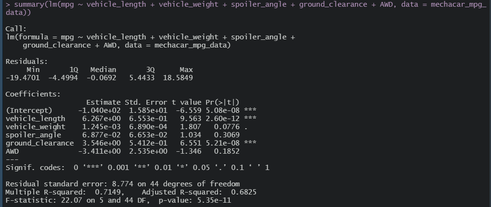

# MechaCar Statistical Analysis

## Overview of Analysis

AutosRUs’ newest prototype, the MechaCar, is suffering from production troubles that are blocking the manufacturing team’s progress.
The management believes that an analytical review of the production data may provide some insights that could help the manufacturing team.

In this project we have performed a statistical analysis of automobile performance using R programming language. The goal of this project is to:
* identify which variables in the dataset predict the mpg of MechaCar prototypes;
* collect summary statistics on the pounds per square inch (PSI) of the suspension coils from the manufacturing lots;
* determine if manufacturing lots are statistically different from the mean population;
* design a study to compare the MechaCar performance against vehicles from other manufacturers.

## Results

### Linear Regression to Predict MPG

* The most significant variables in our dataset which show a non-random effect on the MPG of the MechaCar are the **Vehicle Length** and the **Ground Clearance**. As indicated by the yellow arrows in the image above, a linear regression model run on these variables against figures for MPG, resulted in p-values of 2.6x10-12 and 5.21x10-8, respectively. The intercept was also statistically significant, indicating that there are likely other factors, not included in our dataset, that have a strong impact on the MPG.
* The slope of the linear model can not be considered to be zero, as the p-value of 5.35x10-11, indicated by the orange arrow above, is lower than even an extreme level of significance, and thus the null hypothesis must be rejected. This means that the relationship between our variables and the miles per gallon is subject to more than random chance.
* Although there are still unconsidered factors, this model does predict the mpg of the MechaCar prototype with some relative effectiveness. The r-squared value of 0.7149, highlighted in the purple box, indicates that the model is 71% accurate... though it could probably do better.

### Summary Statistics on Suspension Coils

The table below shows the summary statistics (mean, median, variance, and standard deviation) for the suspension coil’s PSI for all manufacturing lots (Lot1, Lot2, and Lot3).

The table below shows the summary statistics (mean, median, variance, and standard deviation) for the suspension coil’s PSI for each individual lot.

* The overall variance for suspension coil psi, as shown above in the total summary statistics for all lots, is 62.3 psi, well under the acceptable design specifications (100 psi) as dictated by MechaCar. However, as shown in the summary statistics table for individual lot, the variance for Lot 3 is 170.28 psi, and well over the acceptable threshold. The Lot 3 maufacturing data therefore does not meet the design specification.

### T-Tests on Suspension Coils

**Null Hypothesis:** population mean $=$ **equal** sample mean (The population mean of suspension coil psi is **not statistically different** from the sample mean)

**Alternative Hypothesis:** population mean **not equal** sample mean (The population mean of suspension coil psi is **statistically different** from the sample mean)

- The figure below shows Suspension Coils T-test (for all lots). The population mean is 1500 psi and the sample mean is 1498.78 psi.

The results of the T-test for the suspension coils psi across all manufacturing lots shows that the p-value (0.0603) is not below the significan level (0.05) for us to reject the null hypothesis. They are therefore not statistically different from the population mean of 1500 psi.

- The figure below shows Suspension Coils T-test (for lot1). The population mean is 1500 psi and the sample mean is 1500.00 psi.

The results of the T-test for the suspension coils psi for Lot 1 shows that they are not statistically different from the population mean, and the p-value (1) is not low enough for us to reject the null hypothesis.

- The figure below shows Suspension Coils T-test (for lot2). The population mean is 1500 psi and the sample mean is 1500.20 psi.

The results of the T-test for the suspension coils psi for Lot 2 shows that they are not statistically different from the population mean, and the p-value (0.6072) is not low enough for us to reject the null hypothesis.

- The figure below shows Suspension Coils T-test (for lot3). The population mean is 1500 psi and the sample mean is 1496.14 psi.

The results of the T-test for the suspension coils psi for Lot 3 shows that they are slightly statistically different from the population mean, and the p-value (0.0417) is just low enough for us to reject the null hypothesis. This lot may be need to be discarded.

## Study Design: MechaCar vs Competition
There are many factors that consumers take into consideration when evaluating a car to purchase. However, in a world where ridesharing is becoming more ubiquitous and it's easy and cheap to get around in other people's vehicles, customers looking to purchase a car are looking for more than just a conveyance. They will be looking to buy a car that is an economical means to regularly transport themselves and their items on a reliable, regular basis.
### Metric to test
To narrow down our test, we should evaluate MechaCar's carrying capacity, in cubic inches, in comparison to various competitors' vehicles.
### Null and Alternate Hypothesis
H0: MechaCar prototypes' average carrying capacity is similar to competitor's vehicles in the same vehicle class
Ha: MechaCar prototypes' average carrying capacity is statistically above or below that of competitor vehicles.
### Statistical Test Used
The best statistical test for this would be two-sample t-tests.
### What data is needed
We would need to gather cubic space data from the carrying compartments of all MechaCar prototypes, as well as from all major competitor vehicles.
