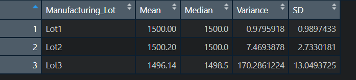

# MechaCar Statistical Analysis

## Overview of Analysis

AutosRUs’ newest prototype, the MechaCar, is suffering from production troubles that are blocking the manufacturing team’s progress.
The management believes that an analytical review of the production data may provide some insights that could help the manufacturing team.

In this project we have performed a statistical analysis of automobile performance using R programming language. The goal of this project is to:
* identify which variables in the dataset predict the mpg of MechaCar prototypes;
* collect summary statistics on the pounds per square inch (PSI) of the suspension coils from the manufacturing lots;
* determine if manufacturing lots are statistically different from the mean population;
* design a study to compare the MechaCar performance against vehicles from other manufacturers.

## Results

### Linear Regression to Predict MPG

The figure below shows the summary statistics for the linear regression model fit to the data for predicting mile per gallon (MPG).
The calculation shows a p-value of 5.35x10-11 and the r-squared value of 0.7149 for the fit.

* It is observed that the **Vehicle Length** and the **Ground Clearance** are the two variables that provide non-random amount of variance to the mpg values in the dataset. The calculation yield p-values of 2.6x10-12 and 5.21x10-8 for the Vehicle Length and the Ground Clearance, respectively.
* The slope of the linear model can not be considered to be zero because the p-value of 5.35x10-11 for the overall fit is lower than even an extreme level of significance, and thus the null hypothesis (that the slope = 0) must be rejected. 
* The r-squared value of 0.7149 indicates that the model is 71% accurate. The model therefore does not predics the mpg of the MechaCar prototype quite effectively and will need some improvement.

### Summary Statistics on Suspension Coils

The table below shows the summary statistics (mean, median, variance, and standard deviation) for the suspension coil’s PSI for all manufacturing lots (Lot1, Lot2, and Lot3).

The table below shows the summary statistics (mean, median, variance, and standard deviation) for the suspension coil’s PSI for each individual lot.

* The overall variance for suspension coil psi, as shown above in the total summary statistics for all lots, is 62.3 psi, well under the acceptable design specifications (100 psi) as dictated by MechaCar. However, as shown in the summary statistics table for individual lot, the variance for Lot 3 is 170.28 psi, and well over the acceptable threshold. The Lot 3 maufacturing data therefore does not meet the design specification.

### T-Tests on Suspension Coils

**Null Hypothesis (H0):** sample mean = population mean (sample mean of suspension coil psi is **not statistically different** from the population mean)\
**Alt Hypothesis (Ha):** sample mean ≠ population mean (sample mean of suspension coil psi is **statistically different** from the population mean)\

population mean = 1500 psi

- The figure below shows Suspension Coils T-test (for all lots). The sample mean is calculated to be 1498.78 psi.

The results of the T-test for the suspension coils psi across all manufacturing lots shows that the p-value (0.0603) is not below the significan level (0.05) for us to reject the null hypothesis. They are therefore not statistically different from the population mean of 1500 psi.

- The figure below shows Suspension Coils T-test (for lot1). The sample mean is calculated to be 1500.00 psi.

The results of the T-test for the suspension coils psi for Lot 1 shows that they are not statistically different from the population mean, and the p-value (1) is not low enough for us to reject the null hypothesis.

- The figure below shows Suspension Coils T-test (for lot2). The sample mean is calculated to be 1500.20 psi.

The results of the T-test for the suspension coils psi for Lot 2 shows that they are not statistically different from the population mean, and the p-value (0.6072) is not low enough for us to reject the null hypothesis.

- The figure below shows Suspension Coils T-test (for lot3). The sample mean is calculated to be 1496.14 psi.

The results of the T-test for the suspension coils psi for Lot 3 shows that they are slightly statistically different from the population mean, and the p-value (0.0417) is just low enough for us to reject the null hypothesis. This lot may be need to be discarded.

## Study Design: MechaCar vs Competition
There are several metrics that the consumer pay attention to when they buy a car. Fuel costs are likely to go higher in the future. So, one of the metric that consumers look for is the average fuel efficiency. If they are buying a MechaCar they would want to know, how the MechaCar would performs in comparison to competitors car.

- **Metric to test:** To answer the above question, one would have to carry out a statistical analysis of the metric, fuel efficiency, for MechaCar in relation to various competitors' car.

- **Null and Alternate Hypothesis:** The null and alternative hypothesis would be,\
H0: MechaCar prototypes' average fuel efficiency is similar to competitor's vehicles.\
Ha: MechaCar prototypes' average fuel efficiency is statistically above or below that of competitor vehicles.

- **Statistical Test Used:** The best statistical test for this analysis would be two-sample t-tests.

- **What data is needed:** We would need to gather fuel efficiency of all MechaCar prototypes, as well as from all major competitor vehicles.
